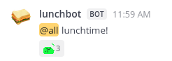

# lunchbot
Automatic mattermost notifications for lunchtime

### Creating an incoming webhook for Mattermost
The first thing you will need is a so-called incoming webhook, which allows automatic message posting on Mattermost. Follow the first part of the [documentation](https://developers.mattermost.com/integrate/webhooks/incoming/?utm_source=mattermost&utm_medium=in-product&utm_content=installed_incoming_webhooks&uid=d5p7qup7off9jy48u5qbek68uc&sid=1q5ehw3axtgk9ex8e9i8nez95o) ('Create an incoming webhook').
You'll receive a custom url that can be used to post automatic messages by making simple POST requests.
In the `lunchbot` folder, make a file `URL.py` and write `lunchboturl = '<your URL>'` in it. Or store it in any other format you prefer, but in that case you'll have to fix the imports in `lunchbot.py`.

Note: the incoming webhook and associated url are specific to a Mattermost team.
Make sure to have selected the correct team when you create the webhook.
The same webhook can be used within a team to send messages to multiple channels, that can be specified while making the POST request as detailed below (though a default channel can be set as well when creating the webhook).

### Making POST requests
The script `lunchbot.py` takes care of formatting and posting the POST request correctly. Run the script with `python3 lunchbot.py -h` (or simply `./lunchbot.py -h`) to see a list of available options. You can specify:
- message: either directly a text string, or a path to a `.txt` file holding the message you want to post. If not specified, a default test message will be used.
- channel: name of the channel to post to. Note that this name can be inferred from the url of the channel, and might be different from the name that is displayed in the left side menu bar. For example, for the channel displayed as 'Town Square', you should use the name 'town-square'. If the channel name is not specified, the default channel chosen when creating the incoming webhook will be used.
Running the script should, if everything went well, post the specified message in the specified Mattermost channel.

### Setting up a cron job
For automatic messages at specific days and/or times of the day, `lunchbot.py` can be executed in a `cron` job.
More detailed information on `cron` jobs can be found for example [here](https://www.digitalocean.com/community/tutorials/how-to-use-cron-to-automate-tasks-ubuntu-1804).
As an example, one could add the following line to the `crontab` file:

```0 12 * * * cd /home/luklambr/Programs/lunchbot && ./lunchbot.py --channel town-square --message '@all lunchtime!' > /home/luklambr/Programs/lunchbot/log.txt 2> /home/luklambr/Programs/lunchbot/log.txt```

This will post the message '@all lunchtime!' at exactly 12h every day in the 'Town Square' channel of the Mattermost group where the incoming webhook was created. The textual output of the script is redirected to a log file `log.txt` so you can investigate potential errors.
If everything went well, you should see something like this in the specified Mattermost channel:



### More complicated examples
Rather than having fixed messages at fixed times as in the example above, lunchbot can be used for more complicated and fun messaging as well, such as automatic birthday notifications, posting NASA's astronomy picture of the day, etc. See the examples in the `messages` folder and experiment with your own!
